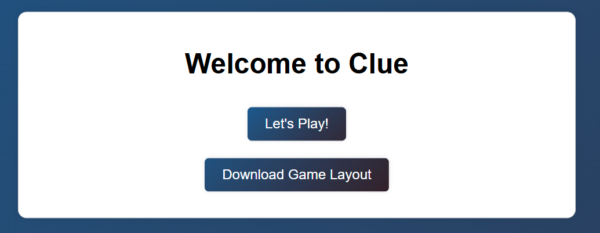
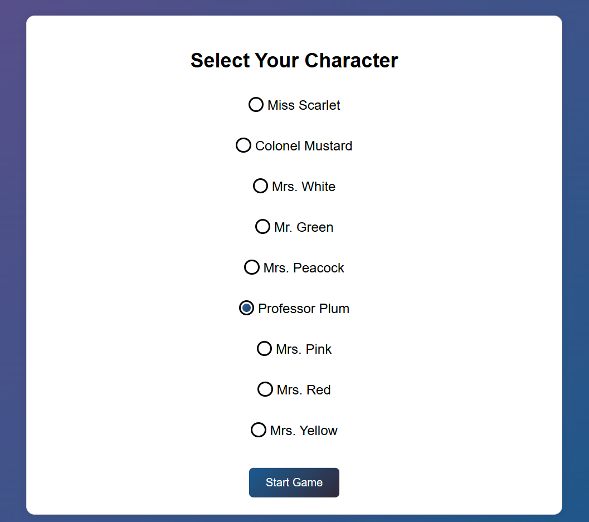
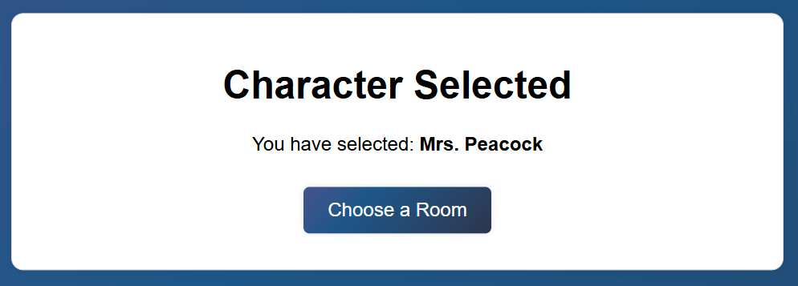
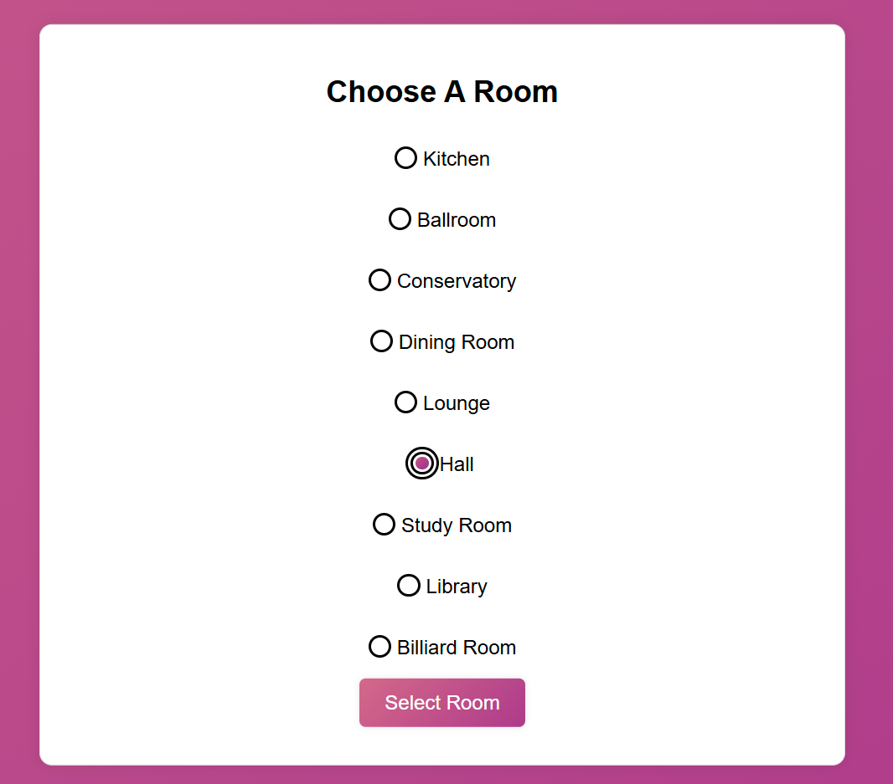

# Steps for Project Part 2 Using PyCharm

## Step 1: Create a Virtual Enviornment
* Open built in terminal in PyCharm
* cd .venv/Scripts
* ./activate

## Step 2: Install Libraries from requirements.txt
* Change the directory to CS670
    * cd ../..
* pip install -r requirements.txt

## Step 3: Change directory to Part2
* cd CS670/Part2

## Step 4: Run app.py
* python app.py
* File containing Game Set Up will open automatically and be saved under 'Layout' directory

# How the game works!

## Step 1: Home Page
* Let's Play! (Button)
    * Starts the Clue Game (<i><b>Refer to Step 2</b></i>)

* Download Game Layout (Button)
    * An xlsx file will be saved automatically under the 'Layout' folder
    * If the directory does not exist, a new directory will be created called 'Layout'
    * The xlsx file contains the information regarding the Game Setup
        * Solution will be shown under 'Solution Selection' sheet
        * All other setups will be shown under their respective sheets
      
     
    

         
    

     

## Step 2: Character Selection
* You have the option to select a character from the form. 
    * The character chosen, will be saved throughout the rest of the game.
    * NOTE: You MUST select a character to continue to Step 3.
  
     
    

         
    

     

* Character Selection Confirmation 

     
    

         
    

     

## Step 3: Room Selection
* You will now have to select a room inside the mansion.
    * You can always navigate to different rooms (<i><b>Refer to Step 4</b></i>)
* NOTE: You MUST select a room to continue to Step 4

     
    

         
    

     

## Step 4: Overview Page
 

     

 

* Left Box (<b>Choose What's Next?</b>)
  * You have the ability to navigate through different rooms (<i><b>Refer to Step 3</b></i>)
  * You have the ability to suggest who the culprit is (<i><b>Refer to Step 5</b></i>)
* Right Box (<b>Your Information!</b>)
  * You have the ability to make any deductions
  * You have the ability to save or clear out your deductions 
    * If cleared, your session will be cleared of all your saved deductions
  * You have the ability to refute a suggestion
    * Cards will show if there is a match in the culprit's actions
