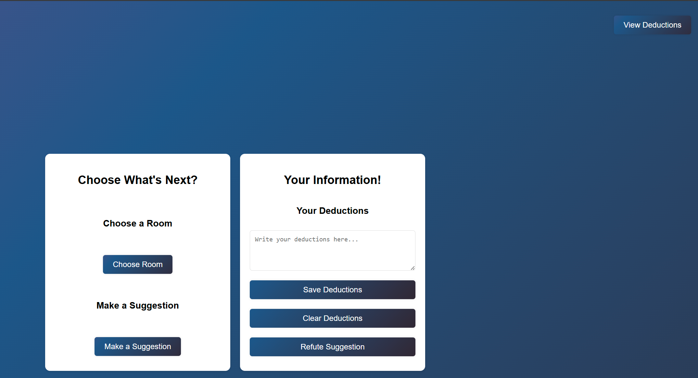
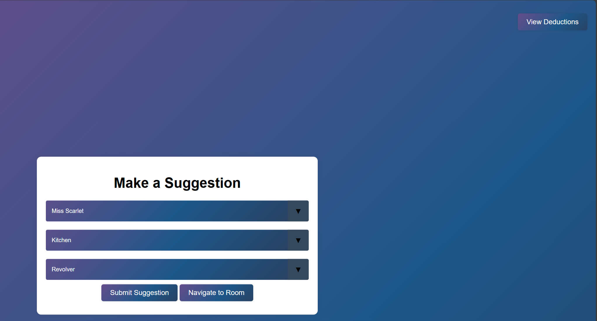
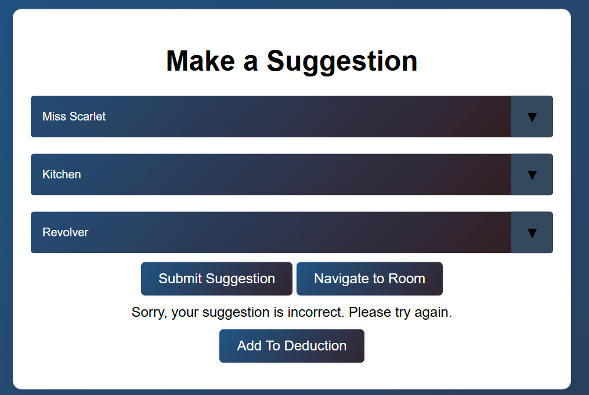
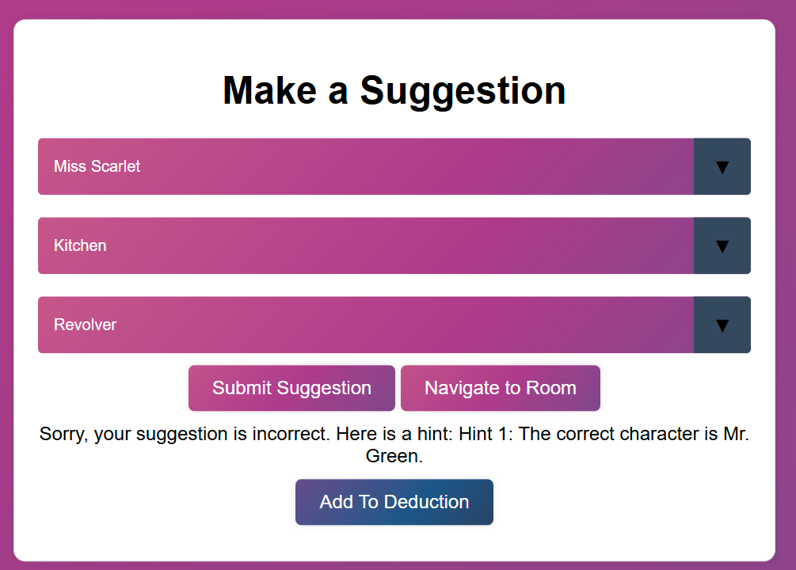

# Steps for Project 2 Part 2 Using Pycharm 

# _**App Startup**_
* **NOTE**: Below steps should be made through terminal to start the application

### Step 1 (Create A Virtual Environment):
* Set up your environment through interpreter settings
* Navigate to terminal (Built within PyCharm)
* cd .venv/Scripts 
* ./activate 

### Step 2 (Install Prerequisites From requirements.txt):
* Change your directory to CS670
* Run below command
  * pip install -r requirements.txt

### Step 3 (Change Directory to Part2):
* cd CS670/Part2

### Step 4 (Run the application):
* python app.py

# **_**Game Steps**_**

### Step 1 (Home Page):
* Let's Play! (Button)
  * Starts the Clue Game (**_Refer to Step 2_**)
* Download Game Layout (Button)
  * An xlsx file will be saved automatically under the _**Layout**_ folder
  * If the directory does not exist, a new directory will be created called _**Layout**_
  * The xlsx file contains the information regarding the Game Setup
    * Solution will be shown under _**Solution Selection**_ sheet
    * All other setups will be shown under their respective sheets
    

### Step 2 (Character Selection):
* You have the option to select a character from the form. 
  * The character chosen, will be saved throughout the rest of the game. 
  * **NOTE**: You **MUST** select a character to continue to **_Step 3_**.

*  _**Confirmation**_

### Step 3 (Room Selection):
* You will now select a room within the mansion.
  * You can always navigate to a different room (**_Refer to Step 4_**)
* **NOTE**: You **MUST** select a room to continue on to **_Step 4_**

### Step 4 (Overview Page):
* Left Box (**_Choose What's Next?_**)
  * You have the ability to navigate through different rooms (**_Refer to Step 3_**)
  * You have the ability to suggest who the culprit is (**_Refer to Step 5_**)
* Right Box (**_Your Information!_**)
  * You have the ability to make any deductions 
  * You have the ability to save or clear out your deductions 
    * If cleared, your session will be cleared of all your saved deductions 
  * You have the ability to refute a suggestion 
    * Cards will show if there is a match in the culprit's actions.

### Step 5 (Make a Suggestion):

* From the dropdown list you **MUST** select one of the following:
  * Character
  * Room
  * Weapon

### Trails 
* First Retry:
  * If the suggestion is incorrect, a message will be shown indicating the wrong suggestion
  
* All trials after the first retry 
  * If the suggestion is still incorrect, you will receive different hints until all 3 hints are given.
  